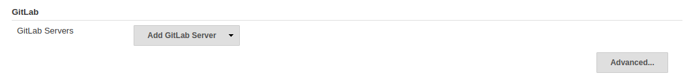
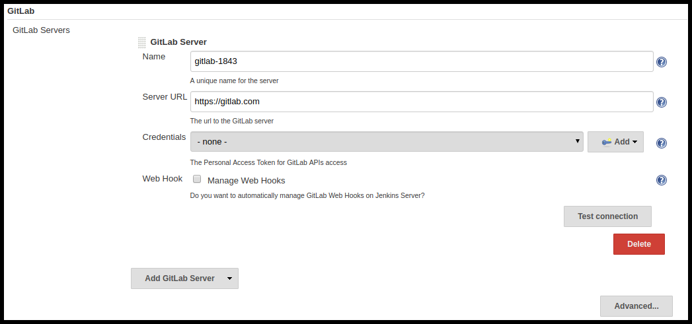
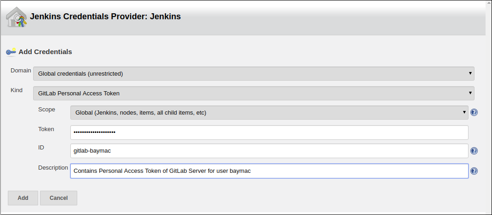
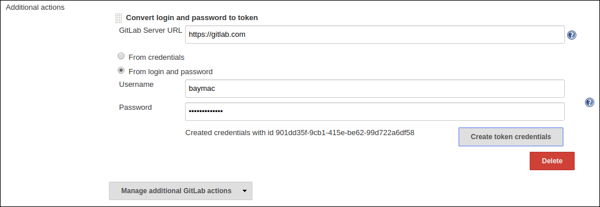

[](https://travis-ci.org/baymac/gitlab-branch-source-plugin)
[](https://github.com/baymac/gitlab-branch-source-plugin/releases)

# GitLab Branch Source Plugin

**This repository contains source code for:**

* GitLab Server Configuration
* GitLab Branch Source 

To fully be able to run a Jenkins Continuous Integration on a GitLab repository or project, you require three plugins:

1. [GitLab API Plugin](https://github.com/jenkinsci/gitlab-api-plugin) - Wraps GitHub Java API

2. GitLab Plugin - Server configuration and web hooks Management 

3. GitLab Branch Source Plugin - To support Multi Branch Pipeline Jobs (including Merge Requests) and Folder organisation

This repository contains two packages `io.jenkins.plugins.gitlabserverconfig` and `io.jenkins.plugins.gitlabbranchsource`. Ideally
the former package should reside inside another plugin with name `GitLab Plugin`. 

## Jenkins and GitLab Integration:

This section contains information about Jenkins CI support for GitLab.

### Present State

1. FreeStyle Job and Pipeline(Single Branch) Job are fully supported.

2. Multi branch Pipeline Job is partially supported (no MRs detection).

3. GitLab Folder Organisation is not supported.

### Issues

1. The GitLab Java APIs are written within the plugin itself when it should be a different plugin.

2. Multi branch Pipeline support is missing.

3. GitLab Folder Organisation for GitLab Projects is missing.

4. Convention for 3 separate plugin is not followed (e.g. - github-api-plugin, github-plugin, github-branch-source-plugin).

### Goals of this project

1. Implement a lightweight GitLab Plugin that depends on GitLab API Plugin

2. Follow convention of 3 separate plugins (as listed above)

3. Implement GitLab Branch Source Plugin

4. Support new Jenkins features such as [Jenkins Code as Configuration](https://github.com/jenkinsci/configuration-as-code-plugin) (JCasc)

5. Provide rich user experience

6. Support all SCM Trait APIs

7. Fully support Java 8

## Building the plugin

No binaries are available for this plugin as the plugin is in the very early alpha stage, and not ready for the general public quite yet.  If you want to jump in early, you can try building it yourself from source.

### Installation:

1) Checkout out source code to your local machine:

     ```bash
     git clone https://github.com/baymac/gitlab-branch-source-plugin.git\
    
     cd gitlab-branch-source-plugin
     ```

2) Install the plugin:
    
    ```bash
    mvn clean install 
    ```
    or
    ```bash
    mvn clean install -DskipTests # to skip tests
    ```

3) Run the Plugin:

    ```bash
    mvn hpi:run # runs a Jenkins instance at localhost:8080
    ```
    
    or
    
    ```bash
    mvn hpi:run -Djetty.port={port} # to run on your desired port number 
    ```

    If you want to test it with your Jenkins server, after `mvn clean install` follow these steps in your Jenkins instance:
    
    1. Select `Manage Jenkins`
    
    2. Select `Manage Plugins`
    
    3. Select `Advanced` tab
    
    3. In `Upload Plugin` section, select `Choose file`
    
    4. Select `${root_dir}/target/gitlab-branch-source.hpi`
    
    5. Select `Upload` 
    
    6. Select `Install without restart`
    
## Getting Started

Jenkins is an open source, self hosting automation server for continuous integration and continuous delivery. The source
code of the core Jenkins and its plugins are written in Java. There are developments
on a modern Jenkins Server (see: [Blueocean Plugin](https://github.com/jenkinsci/blueocean-plugin)) using React and other modern front end tools to provide rich user experience.

For more Jenkins related information, see [documentation](https://jenkins.io/doc/).

### Extending Jenkins 

Jenkins has more than a 1000 plugins so a vast set of functionality has already been implemented and this can be used to leverage
new plugins. Jenkins has an extensibility feature that allows plugin to use other plugins or
core features simply by extending their classes. To define or create an extension in Jenkins, 
we use the `@Extension` annotation type. This annotation is picked up by Jenkins, and the new extension will be added to an
`ExtensionList` object, where the extension can then be found via `ExtensionFinder`.

### Running your Jenkins server:

Here are a few ways to setup your own Jenkins server:

1. Using a Jenkins docker:
    
    i. Download docker image from [here](https://hub.docker.com/r/jenkins/jenkins)
    
    ii. Open up a terminal/command prompt window to the download directory
    
    iii. Run command:
    
    ```bash
    docker run \
      -u root \ 
      --rm \ 
      -d \ 
      -p 8080:8080 \ 
      -p 50000:50000 \ 
      -v jenkins-data:/var/jenkins_home \ 
      -v /var/run/docker.sock:/var/run/docker.sock \
	  --name jenkins \
      jenkinsci/blueocean 
    ```
    
    iv. Browse to `http://localhost:8080`
    
    If you need more information about docker commands, see [here](https://jenkins.io/doc/book/installing/#on-macos-and-linux).
    
2. Using a Jenkins Web application Archive (WAR) :

    i. Download [latest stable Jenkins WAR file](http://mirrors.jenkins.io/war-stable/latest/jenkins.war)
    
    ii. Open up a terminal/command prompt window to the download directory
    
    iii. Run command
    
    ```bash
    java -jar jenkins.war
    ```
    
    iv. Browse to `http://localhost:8080/jenkins`
    
3. Using a Jenkins Azure solution:

    Refer to Azure [docs](https://docs.microsoft.com/en-us/azure/architecture/example-scenario/apps/jenkins).
   
4. Using a Bitnami Jenkins Stack:

    Refer to Bitnami [docs](https://docs.bitnami.com/general/apps/jenkins/).
    
### Post installation:

1. Unlock your Jenkins instance:

    i. From the Jenkins console log output, copy the automatically-generated alphanumeric password
   
    ii. On the Unlock Jenkins page, paste this password into the Administrator password field and click Continue
    
2. Customizing Jenkins with plugins

   Click one of the two options shown:
       
    i. `Install suggested plugins` - to install the recommended set of plugins, which are based on most common use cases.
       
    ii. `Select plugins to install` - to choose which set of plugins to initially install. When you first access the plugin selection page, the suggested plugins are selected by default.
    
3. Create an admin user

    i. When the Create First Admin User page appears, specify the details for your administrator user in the respective fields and click Save and Finish.
    
    ii. When the Jenkins is ready page appears, click Start using Jenkins.
    
    iii. If required, log in to Jenkins with the credentials of the user you just created and you are ready to start using Jenkins!

## Usage

Assuming plugin installation has been done already.

### Setting up GitLab Server Configuration on Jenkins

1. On jenkins, select `Manage Jenkins`

2. Select `Configure System`

3. Scroll down to find the `GitLab` section

   

4. Select `Add GitLab Server` | Select `GitLab Server`

5. Now you will now see the GitLab Server Configuration options
   
   
   
   There are 4 fields that needs to be configured:
       
    i. `Name` - Plugin automatically generates an unique server name for you. User may want to configure this field to suit their needs but
           should make sure it is sufficiently unique. We recommend to keep it as it is.
       
    ii. `Server URL` - Contains the URL to your GitLab Server. By default it is set to "https://gitlab.com". User can modify it to enter their
    GitLab Server URL e.g. https://gitlab.gnome.org/, http://gitlab.example.com:7990. etc.
    
    iii. `Credentials` - Contains a list of credentials entries that are of type GitLab Personal Access Token. When no credential has
    been added it shows "-none-". User can add a credential by clicking "Add" button.
    
    iv. `Web Hook` - This field is a checkbox. If you want the plugin to setup a webhook on your GitLab project(s) related jobs, check this box. 
    The plugin listens to a URL for the concerned GitLab project(s) and when an event occurs in the GitLab Server, the server
    sends an event trigger to the URL where the webhook is setup. If you want continuous integration (or continuous delivery) on your
    GitLab project then you may want to automatically set it up.
     
6. Adding a Personal Access Token Credentials:

   This is a manual setup. To automatically generate Personal Accees Token see next [section](#creating-personal-access-token-within-jenkins).

    i. User is required to add a `GitLab Personal Access Token` type credentials entry to securely persist the token inside Jenkins

    ii. Generate a Personal Access Token on your GitLab Server
        
        a. Select profile dropdown menu from top-right corner
        
        b. Select `Settings`
        
        c. Select `Access Token` from left column
        
        d. Enter a name | Set Scope to `api`,`read_user`, `read_repository`
        
        e. Select `Create Personal Access Token`
        
        f. Copy the token generated
        
    iii. Return to Jenkins | Select `Add` in Credentials field | Select `Jenkins`
    
    iv. Set `Kind` to GitLab Personal Access Token
    
    v. Enter `Token`
    
    vi. Enter a unique id in `ID`
    
    vii. Enter a human readable description
    
      
    
    viii. Select `Add`
    
7. Testing connection:

    i. Select your desired token in the `Credentials` dropdown
    
    ii. Select `Test Connection`
    
    iii. It should return something like `Credentials verified for user {username}`
    
8. Select `Apply` (at the bottom)

9. GitLab Server is now setup on Jenkins

#### Creating Personal Access Token within Jenkins

User does not have to go to your GitLab Server settings for creating GitLab Personal Access Token, this can be done
automatically inside Jenkins itself.

1. Select `Advanced` at the bottom of `GitLab` Section.

2. Select `Manage Additional GitLab Actions`

3. Select `Convert login and password to token`

4. Set the `GitLab Server URL`

5. There are 2 options to generate token;

    i. `From credentials` - To select an already persisting Username Password Credentials or add an Username Password
    credential to persist it.
    
    ii. `From login and password` - If this is a one time thing then you can directly enter you credentials to the text boxes
    and the username/password credential is not persisted.
    
6. After setting your username/password credential, select `Create token credentials`.

7. The plugin will automatically create a Personal Token Access Token in your GitLab Server for the give user and with the
required scope. You can go back to the GitLab Server Configuration to select the new credentials generated. Identify the new
credentials with the `id` returned by token creator. It should be a a 128-bit long UUID-4 string (36 characters).

   
   
### Configuration as Code

There is an easier way to setup GitLab Server configuration on your Jenkins server. Jenkins
Configuration as Code (JCasC) allows you to configure your Jenkins Global Configuration by a simple `yaml` file. If you
use Jenkins Code as Configuration on your Jenkins Instance, you can add the following to your `jenkins.yaml`. 

```yaml
credentials:
  system:
    domainCredentials:
      - credentials:
          - gitlabPersonalAccessToken:
              scope: SYSTEM
              id: "i<3GitLab"
              token: "XfsqZvVtAx5YCph5bq3r" # gitlab personal access token

unclassified:
  gitLabServers:
    servers:
      - credentialsId: "i<3GitLab"
        manageHooks: true
        name: "gitlab.com"
        serverUrl: "https://gitlab.com"
```

See handling secrets [section](https://github.com/jenkinsci/configuration-as-code-plugin#handling-secrets) for better
security.

### Setting up GitLab for jobs

This section is a **Work in Progress**. Will be updated upon release.

## Issues

This project uses Jenkins [JIRA](https://issues.jenkins-ci.org/) to track issues. You can file issues under `gitlab-branch-source-plugin` component.

## Acknowledgements

This plugin is built and maintained by the Google Summer of Code (GSoC) Team for
[Multi branch Pipeline Support for GitLab](https://jenkins.io/projects/gsoc/2019/gitlab-support-for-multibranch-pipeline/).

The team consists of:

* [baymac](https://www.github.com/baymac) (Student)
* [LinuxSuRen](https://github.com/LinuxSuRen) (Mentor)
* [Marky](https://github.com/markyjackson-taulia) (Mentor)
* [Joseph](https://github.com/casz) (Mentor)
* [Justin](https://github.com/justinharringa) (Mentor)
* [Jeff](https://github.com/jeffpearce) (Mentor)

External Support:

* [Oleg](https://github.com/oleg-nenashev) (The org admin who helps with all technical issues)
* [Greg](https://github.com/gmessner) (The creator of GitLab4J APIs)
* [Stephen](https://github.com/stephenc) (The creator of SCM related Plugins)

Also thanks to entire Jenkins community for contributing with technical expertise and inspiration.
